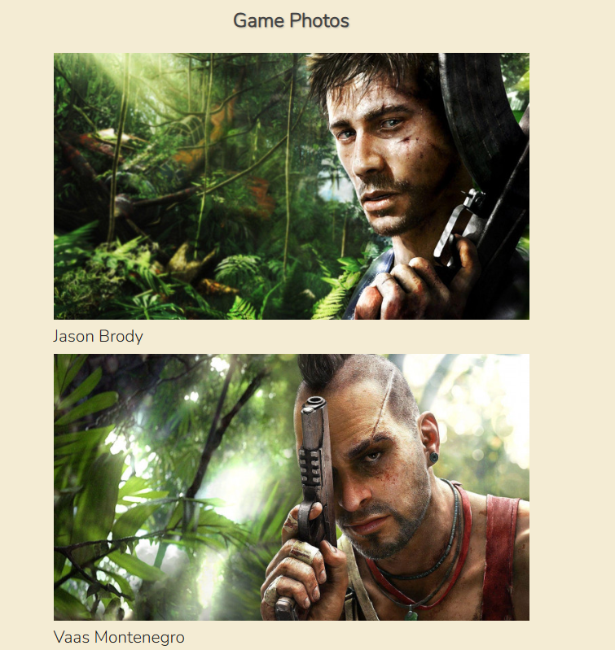

# Far Cry 3 - A Story-Driven Adventure

- This website showcases the immersive world of Far Cry 3, focusing on its captivating narrative and diverse mission types. 
  Discover the game's engaging storyline, and explore the thrilling adventures that await players on the tropical island of Rook.
  
- This project aims to celebrate the rich storytelling and immersive world of Far Cry 3, making it an invaluable resource for fans of the game and newcomers alike.

## Mockup screenshot

Using the "Am I Responsive" website, here is the example of the site showig responsivity.

| Navigation / Welcome / Story / Contact / Gallery |
| :---: | 
|  | 

## UX
 ### The Far Cry 3 website focuses on delivering a seamless user experience with the following features:
 - Easy Navigation: The navigation bar allows users to browse different sections effortlessly.
 - Mobile-Friendly: The website's responsive design ensures optimal viewing on all devices.
 - Consistent Design: A unified color scheme and typography create a visually appealing experience.
 - Accessible Content: The website is designed to be user-friendly and accessible to all users.
 - Engaging Gallery: Image gallery provides an immersive experience for users.

### Colour Scheme

- The colours used are as follows:-

- Background colors:
    - `#f4ecd4` - A light beige color used as the background for the entire `body`
    - `#333` A dark gray color used as the background for the `header` and `footer`
- Text colors:
    - `#444` A dark gray color used as the default text color for the `body`
    - `#fff` White color used for the text in the `header` and `footer`
    - `#070607` A dark gray color used for the text in sections with the `larger-text` class
    - `#222` A dark gray color suggested for the `darker-text` class
- Link colors:
    - `#a49cec` A light purple color used for the links in the navigation.
- Additionally, some elements have been styled with `text-shadow` to give them a subtle depth effect.

### Typography

- I used the Google Font called 'Nunito, sans-serif' for my Far Cry 3 site.

   - [Nunito](https://fonts.google.com/specimen/Nunito+Sans)

## Features

### Existing Features

 | Feature | Description | Screenshot |
| :---: | :---: | :---: |
| **Disclamer** | This will explain what this site is all about |  |
| **Navigation** | This section will allow the user to easily navigate the site. |  |
| **Plot** | This section will intruduce users with the game story |  |
| **Gameplay-features** | This section will introduce users with open world and features such as skills,crafting,stelth,hunting etc. |  |
| **Gallery** | Gallery section contain in game photos and some main characters photos |  |
| **Missions** | This section will introduce user with all types of missions in the game |  |
| **Contact us** | This section allow user to get in touch with the community|  |
| **Footer** | The footer contains a link to various social media groups |  |

## Tools & Technologies Used

- [HTML](https://en.wikipedia.org/wiki/HTML) used for the main site content.
- [CSS](https://en.wikipedia.org/wiki/CSS) used for the main site design and layout.
- [Git](https://git-scm.com) used for version control. (`git add`, `git commit`, `git push`)
- [GitHub](https://github.com) used for secure online code storage.
- [GitHub Pages](https://pages.github.com) used for hosting the deployed front-end site.
- [Google Fonts](https://fonts.google.com/) used to search a suitable font.
- [Font Awesome](https://fontawesome.com/) used to add the footer icons.

## Testing

## Code Validation

### HTML

I have used the recommended [HTML W3C Validator](https://validator.w3.org/) to validate all of my HTML files.

| Page | Screenshot | Notes |
| :---: | :---: | :---: |
| Index |  | No errors or warnings to show. |

### CSS

I have used the recommended [CSS Jigsaw Validator](https://jigsaw.w3.org/css-validator/) to validate all of my CSS files.

| Report | Screenshot |
| :---: | :---: |
| style.css |  |

## User Stories

I recruited a variety of people to assist in testing the website, family and friends.

### Content and Code

| Source | Location | Notes |
| --- | --- | --- |
| [W3C](https://validator.w3.org/) | All pages | Validation |
| [W3 Jigsaw](https://jigsaw.w3.org/css-validator/) | All pages | Validation |
| [YouTube](https://www.youtube.com/) | Main page | a source to get an idea of how to lay out the page |
| [Stack Overflow](https://stackoverflow.com/) | Research | additional html and css research |
| [Wikipedia](https://en.wikipedia.org/wiki/Far_Cry_3) | Research | Plot, missions, side missions |

### Media 

  - All the photos were taken from the [Google Images](https://www.google.com/search?sca_esv=9c429154c95b1c4b&rlz=1C1VDKB_enAT1101AT1101&q=far+cry+3+logo&udm=2&fbs=AEQNm0Aa4sjWe7Rqy32pFwRj0UkWd8nbOJfsBGGB5IQQO6L3J_TJ4YMS4eRay1mUcjRHkZxg8Vy0p2Xq9PcZNNq1Ew9zQooLZH5gQS3wVxeld5ohRXutwtU5CU2X36_uLH1pIUk5kgTFJ72LHrHs1dTrQZP2bShAIpXPbBXJuSHMpD67_7PI_IrPeKYP6OPe9Ff2p8rktfex&sa=X&ved=2ahUKEwifjZzErsmJAxWu1gIHHVAuApIQtKgLegQIEhAB&biw=1920&bih=945&dpr=1)

